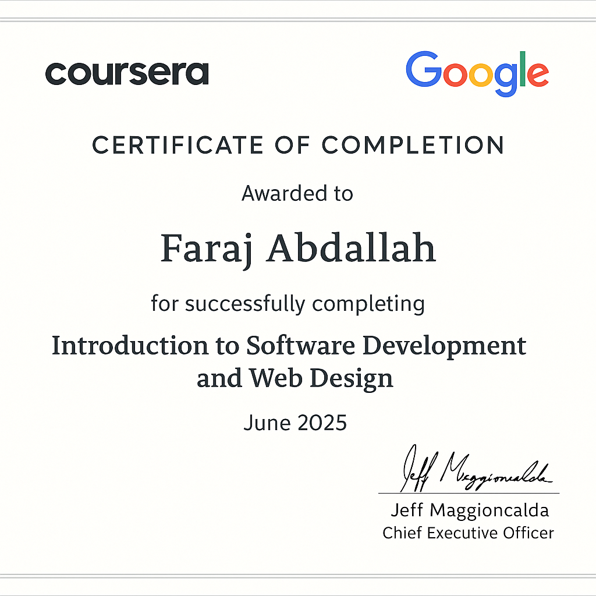

# 📘 كتاب HTML للمبتدئين

**تعلم HTML من الصفر حتى الاحتراف باللغة العربية**  
يشمل شرح مبسط، أمثلة حية، صور توضيحية، وتمارين تطبيقية.

---

## 📌 محتوى الكتاب:

- هيكل صفحات الويب باستخدام HTML
- أشهر العناصر المستخدمة
- صور وروابط وجداول
- مشاريع تطبيقية للمبتدئين

---

## 📸 غلاف الكتاب:

---

## 💻 شراء الكتاب:

- [💰 شراء كتاب](https://faragdev98.github.io/book--HTML-/)

---

## 🛒 روابط الشراء الأخرى:

- [🌿 Gumroad](https://faragdev98.gumroad.com/l/htmlbook)
- [🟧 Payhip](https://payhip.com/b/2cJWp)
- [💬 واتساب](https://wa.me/201066047545)

---

## 🧾 شهادة إتمام الكورس:

---

## 📩 تواصل:

- **WhatsApp:** [01066047545](https://wa.me/201066047545)  
- **المطور:** FaragDev98  

---

© 2025 جميع الحقوق محفوظة
